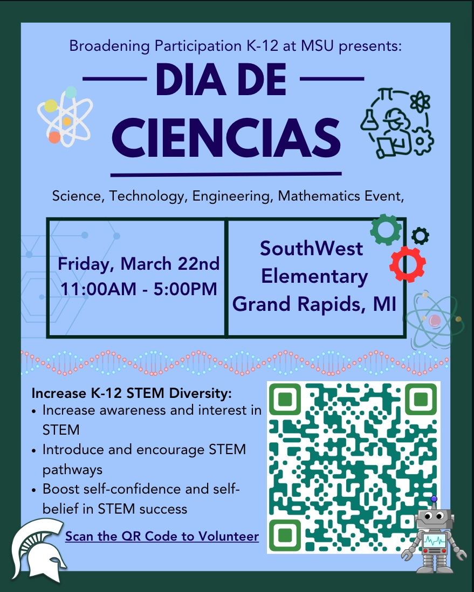

# Dia De Ciencias

The [Society of Hispanic Professional Engineers (SHPE)](https://www.egr.msu.edu/studentgroups/society-hispanic-professional-engineers-shpe) at Michigan State University will be hosting a Dia de Ciencias on **March 25 from 12:00pm - 4:00pm** in the [College of Engineering](https://www.egr.msu.edu/) at Michigan State Unviersity. We welcome students from 7th - 10th grade to com particiapte in a number of STEM activities led by students and faculty. While the students are participating in activities, seminars will be hosted for  parents and chaperones to learn about college/STEM related topics.

