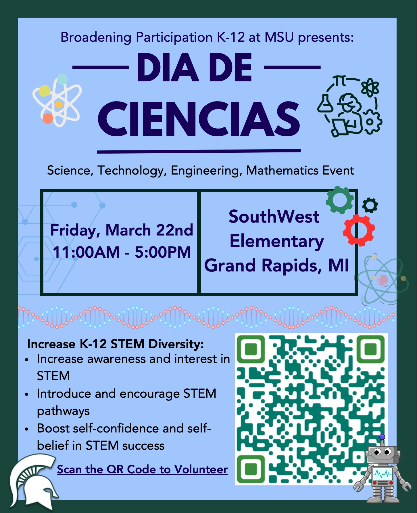

# Dia De Ciencias

The [Broadening Participation K-12 ]([https://www.egr.msu.edu/studentgroups/society-hispanic-professional-engineers-shpe](https://engineering.msu.edu/about/inclusion-diversity/broadening-participation-k-12)) at Michigan State University will be hosting a Dia de Ciencias on **March 22, 2024 from 11:00a.m-5p.m** at SouthWest Elementary School in Grand Rapids, MI.
Students will have an opportunity to particiapte in a number of STEM activities led by MSU students. 

[download flyer here](./Imgs/2024dia-de-ciencias-flyer.jpg)

# Volunteers

For MSU students and activity leaders wanting to help with this event, please download and sign the required forms for the event [here](./Forms/dia-de-ciencias-cbc.pdf).
Once the form is filled and signed, please submit them on our [registration form](https://forms.gle/bBoTMffCMLHMzrSu9).

# Contact

To get more information for this event.
Please contact:
- Teresa Isela VanderSloot at <iselava1@msu.edu>
- Jessika Ruby Hernandez at <herna679@msu.edu>
<!-- - [Teresa Isela VanderSloot](https://www.egr.msu.edu/people/profile/iselava1) at <iselava1@msu.edu> -->
<!-- - [Jose Guadalupe Hernandez](https://jgh9094.github.io/) at <jgh9094@gmail.com>. -->
